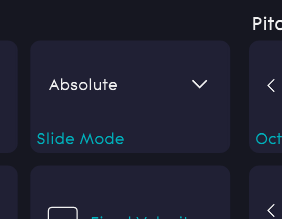
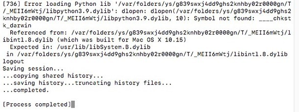
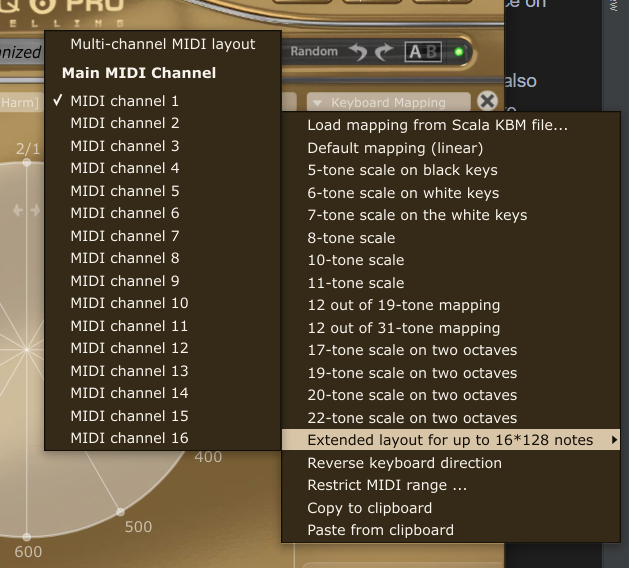
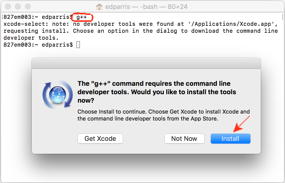

# Microtonal Seaboard Mapper

## Features

- Splits seaboard keys vertically using the Slide dimension & retunes to any arbitrary tuning system
- Cross-platform support
  - Pre-built executables for Windows and macOS (Catalina 10.15 or newer).
  - See [build instructions](#build-instructions) to build the program yourself if you're using an
    older/different OS.
- MPE output mode (For Equator/Strobe/Ableton/Bitwig/etc...)
- MIDI output mode (useful for Pianoteq/Kontakt/ZynAddSubFX/etc) where each 'step' corresponds to 1
  semitone in the output.
- Range splits for MIDI output mode.
  - Open multiple instances of a VST and offset them by +/- 2 octaves to get the full range of a
    piano in 31 edo.
  - [Automatic range splits for Pianoteq](#microtuning-on-pianoteq)
- Different slide (cc74) modes
  - Fixed value of choice
  - Relative
  - Absolute
  - Link slide to press (channel pressure)
  - Bipolar
- Region-specific velocity curve correction for dead/sensitive spots on the seaboard
- Invert sustain pedal (because I couldn't find this feature in Equator)
- Runs a Websocket server that sends note on/off messages in edosteps (for use together with
  [euwbah/n-edo-lattice-visualizer](https://github.com/euwbah/n-edo-lattice-visualiser))

## Quick Start

1. Download the latest release [here](https://github.com/euwbah/microtonal-seaboard/releases).
   - If you are on macOS, the pre-built application only works on Catalina (10.15) or newer
     versions.
   - If you're using an older version or a *nix OS, read the [build instructions](#build-instructions) to build your own application from the source code.
2. Connect your Seaboard RISE/Block, turn it on.
3. Open the ROLI Dashboard and check the pitch bend range setting. Take note of this as you'll have
   to key it in later. Also check the pitch bend range of your synth & DAW. (**If you're using
   Strobe 2 instead of Equator, your pitch bend range must be +/-48 semitones as it is the default
   for all its MPE presets**)
4. **Make sure you set Slide mode to absolute in the ROLI Dashboard**

   

5. **Set slide sensitivity to max.**
6. **Make sure your MIDI mode setting is on MPE mode in the ROLI Dashboard**
6. Create a [Virtual MIDI Port](https://dialogaudio.com/modulationprocessor/guides/virtual_midi/virtual_midi_setup.php).
   Name it whatever you like.
7. Start the seaboard mapping program. It defaults to this 31 edo mapping:
   - White keys are split into 5 vertical segments. From the bottom:
        1. down
        2. natural
        3. up
        4. natural
        5. up
   - Black keys are split into 3. From the bottom:
        1. sharp
        2. flat
        3. up of the next white key
8. Select the Seaboard MIDI input device
9. Select the virtual MIDI port you created as the output device.
10. Use the virtual MIDI port as the MIDI controller for your DAW/VST/Equator. (**Make sure you
   don't activate both the seaboard and virtual port inputs at** **the same time.**)
11. If you want to use a different mapping, enter `map` into the console. Refer to the [`.sbmap` file format](#seaboard-map-sbmap-file-format) and the [31 edo mapping script](https://github.com/euwbah/microtonal-seaboard/blob/master/mapping_generator/edo31.py) on
    how to create your own mappings, or [file an issue](https://github.com/euwbah/microtonal-seaboard/issues/new) with the "Mapping Request"
    label.
12. If you want to use the seaboard with a non-MPE, but microtunable synth (e.g. Pianoteq, Kontakt,
    ZynAddSubFX), you have to turn on [MIDI mode](#midi-mode-keyscapepianoteqkontaktzynaddsubfxetc).

## How does it work

The mapper reads input from the Seaboard and uses the MIDI message CC74 (the 'Slide' dimension) to
distinguish vertical sections of each key. The mapper outputs MIDI data to a virtual MIDI port that
is used to control the Synth.

A mapping file (`.sbmap`) denotes the vertical points where the key splits. Each split key is
assigned a cent offset value (used for MPE mode), and a step number which represents the number of
steps from the note A4 (used for MIDI mode).

## Checklist / Troubleshooting

To make sure this program runs correctly:

- You can't be using a Seaboard GRAND (it doesn't have the slide dimension)
- Turn on & connect seaboard before running the mapper.
- Slide sensitivity must be maximum
- Slide mode must be absolute on the ROLI Dashboard (slide mode inside Equator's Global settings can
  be whatever)
- No. midi channels setting on ROLI Dashboard should be set to maximum (15)
- The pitch bend range specified must be correct as per the ROLI Dashboard, and the pitch bend range
  of the synth used must match the specified range.
  - **Important:** Strobe 2's 5D MPE presets requires a pitch bend range of +/-48 semitones.
- The mappings/ folder must be in the same location as the .exe/.app/executable otherwise the
  default mapping will not load by default.

**IMPORTANT for macOS users**: If you're using the pre-built application, and you get this error:

That means that your OS version is too old. You have to [build the app from source](#build-instructions)

## MPE mode: Equator/Strobe 2/MPE synths/DAWs/etc...

For synths that support MPE, it should work out of the box. Remember to enable only the virtual midi
port as the controller and disable the seaboard midi device's input.

**If you're using Strobe 2, your pitch bend range setting must be 48 on both the ROLI Dashboard and
on the mapper**.

The output MPE messages are similar to the MPE messages sent by the seaboard, with the exception of
two extra pitch bend messages: one before and one after the NOTE ON event is sent.

## MIDI mode: Keyscape/Pianoteq/Kontakt/Zynaddsubfx/etc

After starting the mapper and connecting the devices, type the `midi` command to enter MIDI mode.
MIDI mode maps every split-key partition to a certain note output as denoted by the `.sbmap` mapping
file.

The default 31 edo mapping `default.sbmap` will map A4 to A4. Then, any subsequent diesis up will be
output as the next semitone. A^4 = Bb4, A#4 = B4, Bb4 = C5, etc...

By default, only the first MIDI channel of the output will be used to output plain old MIDI data.
More channels are used depending on the number of keyboard range splits.

Any aftertouch/pitchbend/midi CC messages will be forwarded to all active output channels
simultaneously.

## Range splits: Get more range/keyboard splits in MIDI mode

MIDI only has 127 notes available - when using larger EDOs, the effective range of a single
microtuned synth becomes very limited.

However, with this mapper, the seaboard is now able to output MIDI notes across different MIDI
channels to achieve a larger range using multiple VST instances or using a VST's internal
multi-channel mapping ability.

Pianoteq 6+ natively supports multi-channel midi inputs to obtain a larger range for big EDOs.
[**Follow these simpler instructions instead for pianoteq.**](#microtuning-on-pianoteq).

Otherwise, to get more range out of microtunable synths, you can open multiple instances of them and
set them at different octaves listening to different MIDI channels of the virtual MIDI output port.

Here's an example of what you can do using the default 31 edo mapping:

1. Open 2 instances any synth that supports microtonal tunings
2. Set the first instance to listen to MIDI channel 1 and transpose it one octave lower than normal.
3. Set the second instance to listen to MIDI channel 2 and transpose it up one octave.
4. Enter the `split` command in the mapping program.
5. The mapper prompts: `enter channel split position(s) or leave blank for 1 output channel only: `.
      - Input `e4`. This means that all the notes that lie on the MIDI keys C-1 to Eb4 (inclusive)
        will be outputted on to MIDI channel 1, and the notes E4 and above will be sent to MIDI
        channel 2. (If more splits are needed, input more split points, each one separated by a
        space)
6. Next we are prompted: `enter midi output offset for split range channel 1 (range C-1 - Eb4)`.
      - Input `31`, representing an offset of +31 steps. This offsets the -1 octave transposition of
        the synth instance on channel 1. This way, we get an additional 1 octave range below. If
        you're using a different tuning system/EDO, input the number of steps that represent one
        octave in that tuning system.
7. Similarly, we are prompted: `enter midi output offset for split range channel 2 (range E4 - G9)`.
      - Input `-31`, representing the offset of -31 steps, which offsets the +1 octave of the synth
        instance on channel 2.

Apart from using splits to increase playing range, it can also be used in a 'normal' way to create
keyboard splits where each split plays a different patch.

Any MIDI CCs received will be sent to all active channels at once. As such, if you're using two
instances of Keyscape, it is crucial that you turn off the sustain pedal noise on either one of the
VSTs, otherwise you'd get double the sustain pedal noise.

### Microtuning on Pianoteq

Pianoteq offers [multi-channel keyboard mappings](https://forum.modartt.com/viewtopic.php?id=4307)
which bypasses the need for opening multiple instances of pianoteq in order to get the full range.

To make use of this in the seaboard mapper:

1. Enter the `autosplit` command in the console to turn auto split mode on

2. Under Pianoteq's microtuning screen, there's a button on the top right to change the **keyboard
  mapping**. Click on it and you will see an option titled '**Extended layout for up to 16*128
  notes**'. Open the drop down and select **MIDI channel 5**

- This will cause the notes received on each subsequent MIDI channel to sound one octave higher than
  the previous MIDI channel.
- The checked midi channel (5) denotes the MIDI channel that will not have any octave/equave
  transposition at all.
- E.g. if MIDI channel 5 is selected as the main channel, Notes played on channel 4 will sound one
  octave below what's played, notes played on channel 6 will sound one octave up, etc...
- Note that if the scala tuning file imported on Pianoteq denotes a non-octave tuning (e.g.
  Bohlen-pierce/Wendy Carlos's alpha/beta), then Pianoteq will transpose according to the tuning
  system's [period](https://en.xen.wiki/w/Periods_and_generators).

## Other Settings/Commands

### Save

You can save the current mapping, split, slide and pedal settings using the `save` command.

This generates a file called `config.dill` in the same directory as the executable file.

If you want to override the settings, you can just run the save command anytime. You can store a
particular setting for later use by renaming the `config.dill` file to something else, then renaming
it back to `config.dill` when you want it to be used the next time you open the seaboard mapping
application.

### Slide modes

#### Fixed slide

Enter `slide 0` to set the Slide amount (CC74) to 0 for all notes no matter the Slide input. Values
from 0-127 are allowed.

#### Press slide

Enter `slide prs` to mirror the Press dimension to the Slide dimension.

#### Relative slide (default)

Enter `slide rel` to emulate [relative slide mode](https://support.roli.com/support/solutions/articles/36000025050-slide-absolute-vs-relative)

#### Absolute slide

Enter `slide abs` to forward the raw [absolute slide](https://support.roli.com/support/solutions/articles/36000025050-slide-absolute-vs-relative)
messages unchanged.

#### Bipolar slide

Enter `slide bip` to emulate bipolar slide mode. Initial Strike will yield a Slide value of 0, and
sliding all the way to either to top or bottom will yield the max Slide value of 127.

## Invert sustain pedal

The `sus` command toggle the sustain pedal polarity (so you don't have to reach for the physical
switch on yours)

## Making your own tuning mappings

See [mappings/README.md](mappings/README.md) for more information on how to create your own

## Build Instructions

If the [pre-built releases](https://github.com/euwbah/microtonal-seaboard/releases) don't support
your OS, or if you want to contribute/play around, you can follow the following steps to build the
program yourself. Don't worry it's not hard!

If you have any issues with building, do [file an issue](https://github.com/euwbah/microtonal-seaboard/issues/new) and paste the entire contents of
your terminal.

### Build for macOS

1. You have to be on a mac _(Pyinstaller doesn't support cross-compile)_
2. [Install the latest version of Python](https://www.python.org/downloads/)
   - Double check that you are using the right version of python by opening the terminal/powershell,
     then enter `python3 --version`
3. Download the [latest source code](https://github.com/euwbah/microtonal-seaboard/archive/refs/heads/master.zip)
4. Extract the .zip source code anywhere.
5. You need to check that you have these:
    1. Check that you have `g++` by opening your terminal and entering `g++`. If it says `note: no
       developer tools were found...`, and a prompt pops up with an install button, click it.
       
    2. If you already installed VSTs and DAWs, and have successfully used your Seaboard with the
       Mac, you most probably already have CoreMIDI and/or JACK. If not you should [check that your CoreMIDI is working](https://www.jnote.com/how-to-fix-core-midi-problems-with-osx-after-using-migration-assistant-or-upgrading-system/)
6. Open the terminal within the directory of the extracted source code.
    1. If you're unfamilliar with `cd`, go to **System Preferences > Keyboard > Shortcuts >
       services** and enable **New Terminal at Folder**
    2. Open Finder and right-click on the extracted folder containing the source code.
    3. Click the option **New Terminal at Folder**.
7. Inside the terminal, enter `./build.sh`
    1. If it doesn't work the first time, enter `chmod +x build.sh` then try again.

When that is finished, you should see a new file: `microtonal-seaboard.zip` inside the folder. The
app is contained within. Congrats!

### Build for Windows (you have to be on Windows 10)

1. You have to be on Windows 10 _(Pyinstaller doesn't support cross-compile)_
2. [Install the latest version of Python](https://www.python.org/downloads/)
   - Double check that you are using the right version of python by opening the terminal/powershell,
     then enter `py --version`
3. Download the [latest source code](https://github.com/euwbah/microtonal-seaboard/archive/refs/heads/master.zip)
4. Extract the .zip source code anywhere.
5. You need to check that you have a C++ compiler installed:
    1. If you are uncertain what that is, just download and install this:
    https://visualstudio.microsoft.com/downloads/#build-tools-for-visual-studio-2019
6. Open cmd/powershell in the directory of the extracted folder.
    1. If you're unfamilliar with `cd`, open the folder containing the extracted source code inside
       the File Explorer, then right click any blank empty space, and select the option "Open
       PowerShell window here"
7. Inside the cmd/powershell, run `.\build.bat`

When that is finished, you should see a new file: `microtonal-seaboard-windows.zip` inside the
folder. The app is contained within. Congrats!

### Build for Linux

1. You have to be on Linux/WSL _(Pyinstaller doesn't support cross-compile)_
2. [Install the latest version of Python](https://www.python.org/downloads/)
   - Double check that you are using the right version of python by opening the terminal/powershell,
     then enter `python3 --version`
3. Download the [latest source code](https://github.com/euwbah/microtonal-seaboard/archive/refs/heads/master.zip)
4. Extract the .zip source code anywhere.
5. You need to check that you have these:
    1. If you are on Debian (Ubuntu/Mint/etc)
        1. `sudo apt-get update`
        2. `sudo apt-get build-essential python-dev libasound2-dev`
    2. If you are on Arch/Manjaro
        1. `sudo pacman -Syu`
        2. `sudo pacman -S base-devel alsa-lib`
6. Execute `./build.sh`

When that is finished, you should see a new file: `microtonal-seaboard.zip` inside the folder. The
app is contained within. Congrats!
